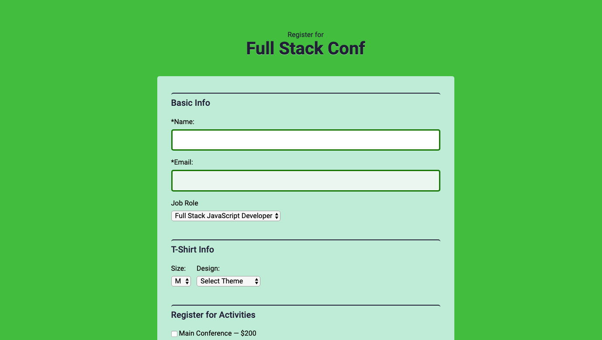

#JavaScript Form Validation

**Description:** Used JavaScript to validate a form before letting a user submit the form

**Why:** This Project was created to practice JavaScript

**Skills** Used: HTML, CSS, JavaScript

